Сначала я скопировал проект в свой github.

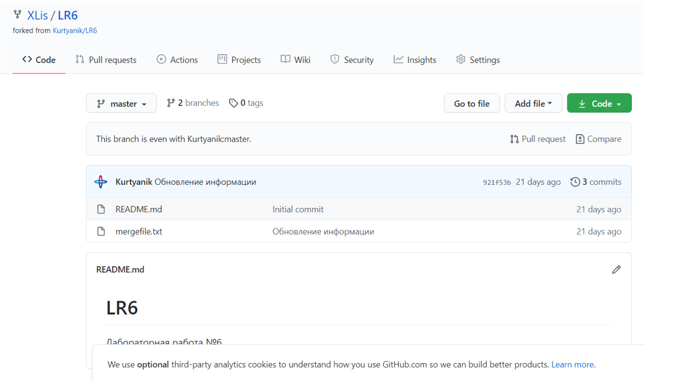

Затем, я ввел свое имя/фамилию и почту. 

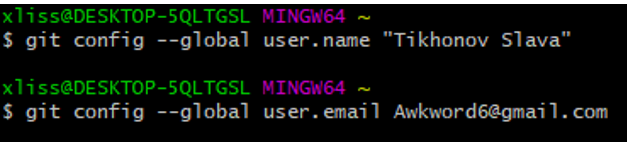

После, я перешел в папку Lab, где будут проходить все манипуляции с репозиторием.

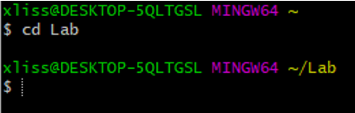

В папке Lab я инициализировал git, затем связал удаленный репозиторий с данной папкой, а затем, клонировал проект в папку. 

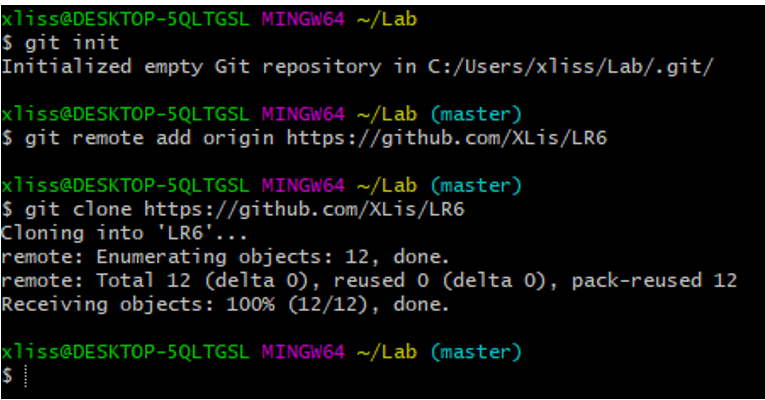

В результате, в папке Lab появляются файлы. 

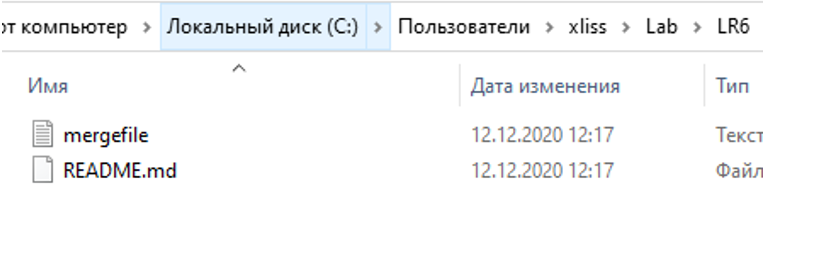

Затем, при помощи GitHub, я создал текстовый файл с примером кода, после чего сохранил при помощи кнопки «Commit new file» 

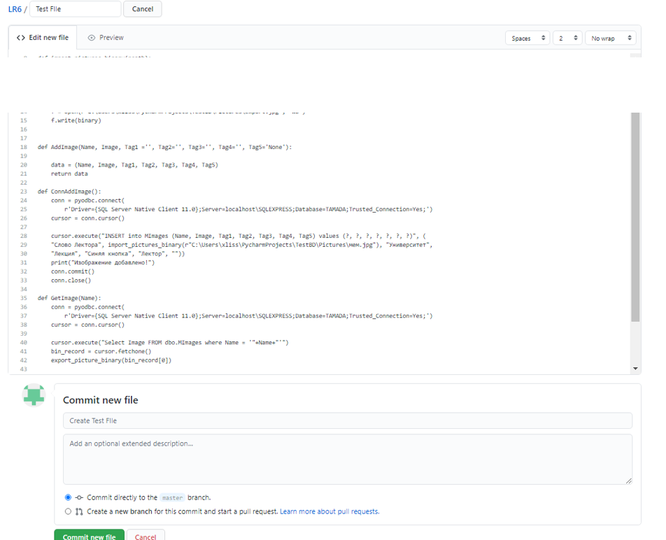

В GtiBash я ввел команду git pull origin master, которая загружает все изменения.

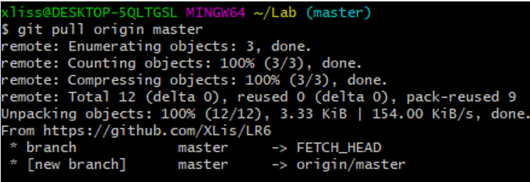

Для того, чтобы посмотреть все последние изменения, можно использовать команду git log.

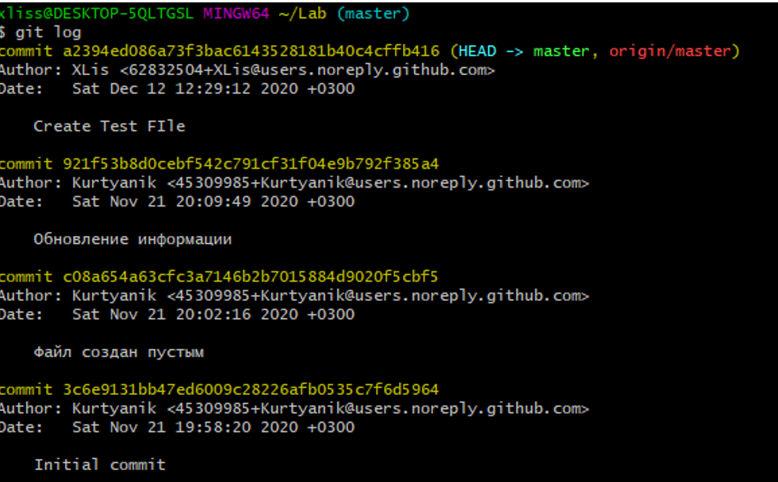

Можно также, например, при помощи команды git show ‘Код коммита’ можно получить подробную информацию 
о последнем изменении

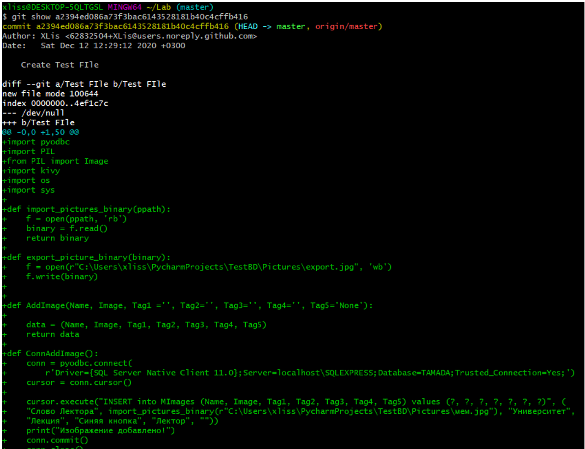

При помощи git checkout можно переключится в различные ветки репозитория. Однако, я попытался 
загрузить в ветку мастер сразу ветку branch1, попутно выполнив слияние. Однако, возникла ошибка.

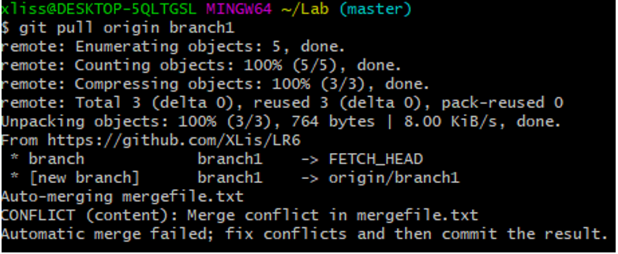

Исправив ошибку в mergefile(конфликт текста внутри), я вновь попробовал слить ветку, и, на этот раз,
все получилось.

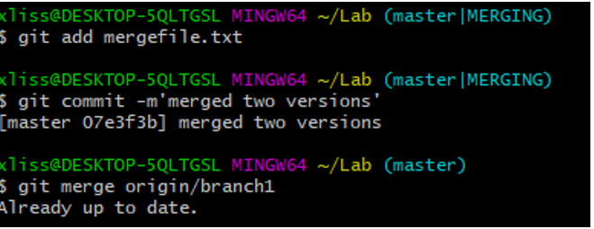

После, я удалил ненужную ветку branch1 и запушил все в github

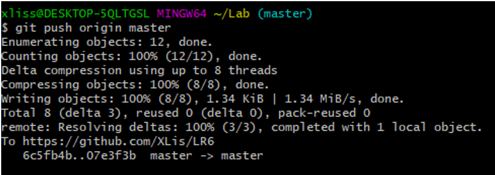

Видно, что осталась лишь одна ветка master 

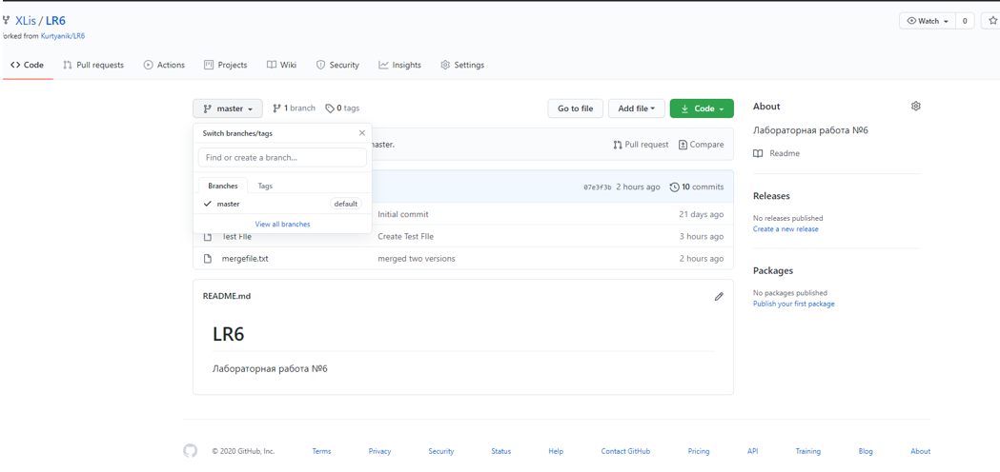

Я создал несколько файлов с разным описанием(причем GitHub создает собственное стандартное описание, 
которое видно возле файла Test File)

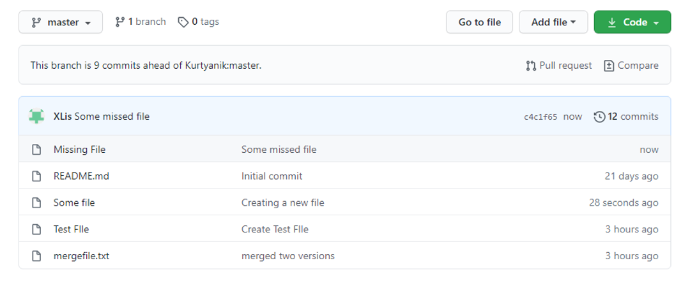

Я забрал изменения и посмотрел лог изменений

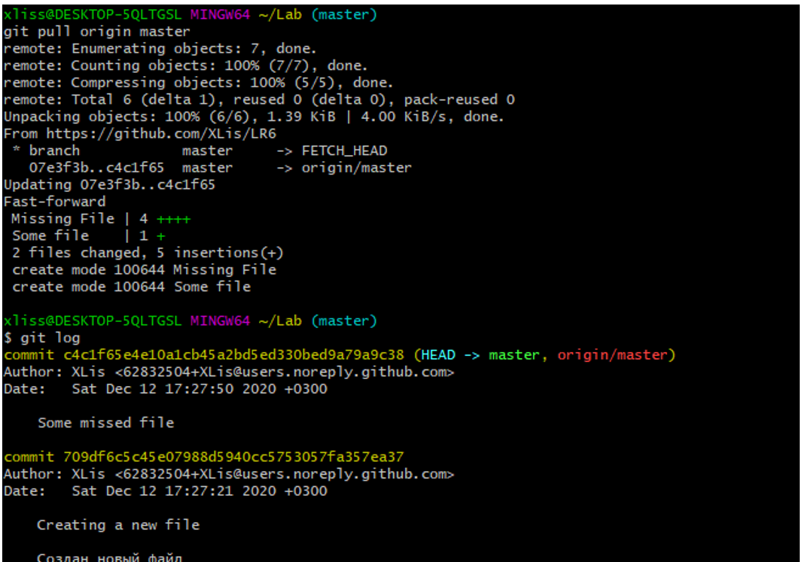

Затем, я удалил последний коммит и запушил результат. -f необходим так как исчез один из файлов, 
чтобы пропустить возможный конфликт. Сообщение HEAD говорит, что теперь последним коммитом является 
создание нового файла.

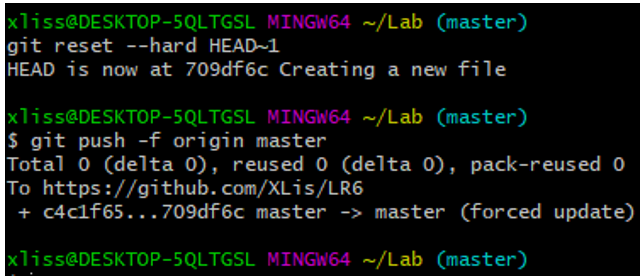

После, я сохранил все скрины в отдельную папку, и при помощи git status проверил наличие файлов
 перед коммитом

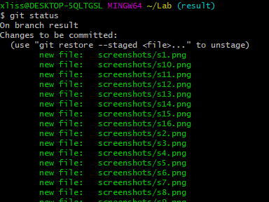

Затем, я создал отчет в файле Readme.md

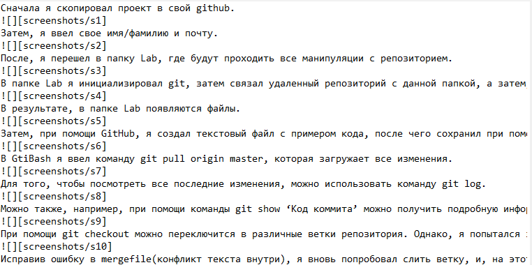

Итоговый лог перед последним коммитом

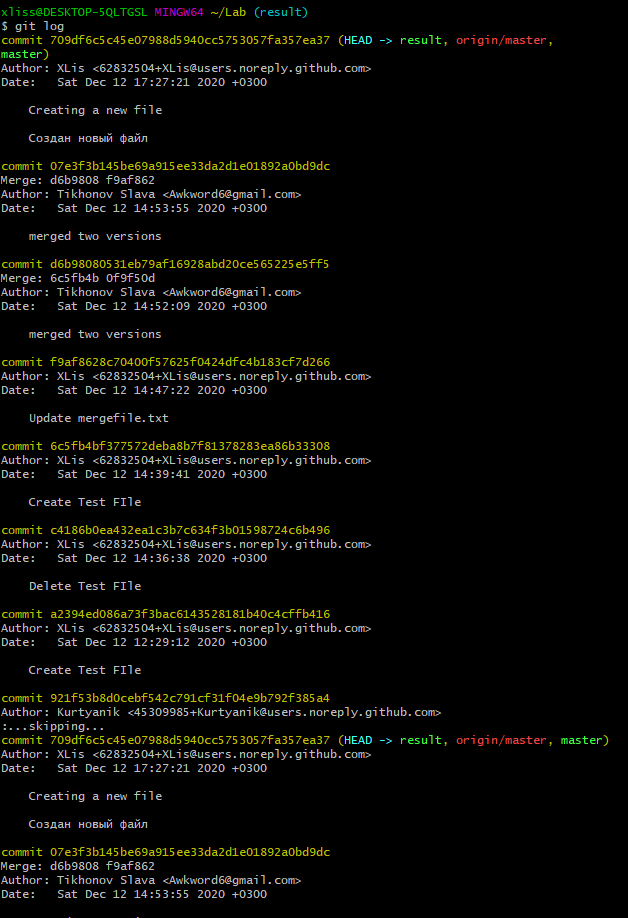

Также можно посмотреть историю операций для каждой из веток(см два скриншота ниже)

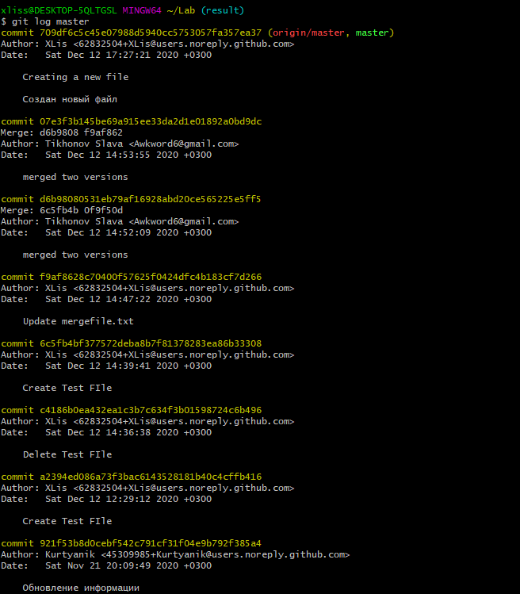

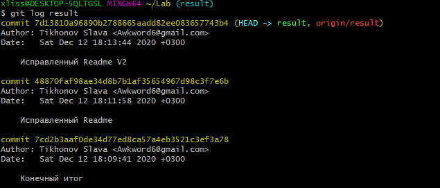

Все скриншоты располагаются в папке screenshots.

