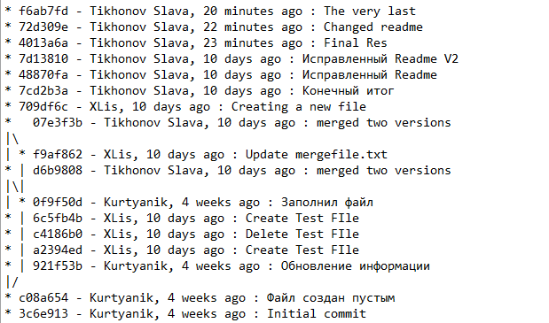

# ЛАБОРАТОРНАЯ РАБОТА №6

Сначала я скопировал проект в свой _Github_.

Затем, я ввел свое имя/фамилию и почту. 

После, я перешел в папку _Lab_, где будут проходить все манипуляции с репозиторием.

В папке Lab я инициализировал _git_, затем связал удаленный репозиторий с данной папкой, а затем, клонировал проект в папку. 

В результате, в папке _Lab_ появляются файлы. 

Затем, при помощи GitHub, я создал текстовый файл с примером кода, после чего сохранил при помощи кнопки _«Commit new file»_ 

В GtiBash я ввел команду _git pull origin master_, которая загружает все изменения.

Для того, чтобы посмотреть все последние изменения, можно использовать команду _git log_.

Можно также, например, при помощи команды _git show ‘Код коммита’_ можно получить подробную информацию 
о последнем изменении

При помощи _git checkout_ можно переключится в различные ветки репозитория. Однако, я попытался 
загрузить в ветку мастер сразу ветку _branch1_, попутно выполнив слияние. Однако, возникла ошибка.

Исправив ошибку в _mergefile_(конфликт текста внутри), я вновь попробовал слить ветку, и, на этот раз,
все получилось.

После, я удалил ненужную ветку _branch1_ и запушил все в _github_

Видно, что осталась лишь одна ветка _master_ 

Я создал несколько файлов с разным описанием(причем GitHub создает собственное стандартное описание, 
которое видно возле файла _Test File_)

Я забрал изменения и посмотрел лог изменений

Затем, я удалил последний коммит и запушил результат. -f необходим так как исчез один из файлов, 
чтобы пропустить возможный конфликт. Сообщение HEAD говорит, что теперь последним коммитом является 
создание нового файла.

После, я сохранил все скрины в отдельную папку, и при помощи _git status_ проверил наличие файлов
 перед коммитом

Затем, я создал отчет в файле _Readme.md_

Итоговый лог перед последним коммитом

## Форматированный лог:

Все скриншоты располагаются в папке screenshots.

